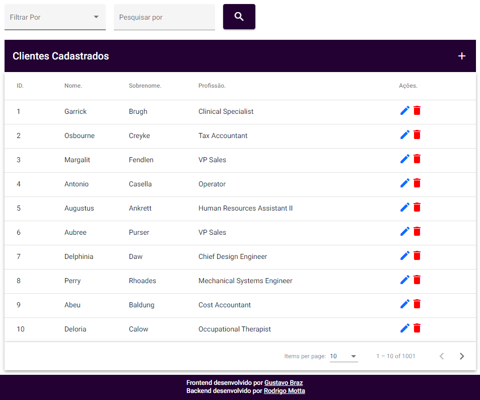

## Customers

Um projeto de estudo de Rest API com **Java** e **Spring Boot** e aplicando a **arquitetura hexagonal**, testes unitários, busca paginada com filtro e ordenação.

[Documentação do Swagger](https://rod-customers.herokuapp.com/swagger-ui.html#/)

https://rod-customers.herokuapp.com/api/customers

|Http Method|Endpoint|Description|
|---|---|---|
|GET|/api/customers|Find all customers.|
|GET|/api/customers/{id}|Find a customer by id.|
|POST|/api/customers|Save a customer.|
|PUT|/api/customers/{id}|Update a customer by id.|
|DELETE|/api/customers/{id}|Delete a customer by id.|

---

Frontend desenvolvido por [Gustavo Braz](https://github.com/GustavoBrazThomaz)

https://gus-customers.herokuapp.com/tabela

